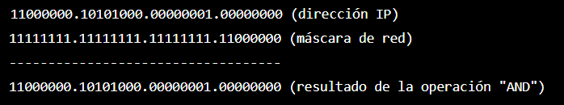

# Subnetting

## ¿Qué es y cómo se interpreta una máscara de red?

**Subnetting** es una técnica utilizada para dividir una red IP en subredes más pequeñas y manejables. Esto se logra mediante el uso de **máscaras de red**, que permiten definir qué bits de la dirección IP corresponden a la **red** y cuáles a los **hosts**.

Para interpretar una máscara de red, se deben identificar los bits que están en “**1**“. Estos bits representan la porción de la dirección IP que corresponde a la **red**. Por ejemplo, una máscara de red de **255.255.255.0** indica que los primeros **tres octetos** de la dirección IP corresponden a la **red**, mientras que el **último octeto** se utiliza para identificar los **hosts**.

Ahora bien, cuando hablamos de **CIDR** (acrónimo de **Classless Inter-Domain Routing**), a lo que nos referimos es a un método de asignación de direcciones IP más eficiente y flexible que el uso de clases de redes IP fijas. Con **CIDR**, una dirección IP se representa mediante una dirección IP base y una máscara de red, que se escriben juntas separadas por una barra (**/**).

Por ejemplo, la dirección IP **192.168.1.1** con una máscara de red de **255.255.255.0** se escribiría como **192.168.1.1/24**.

La máscara de red se representa en notación de prefijo, que indica el número de bits que están en “**1**” en la máscara. En este caso, la máscara de red **255.255.255.0** tiene **24** bits en “**1**” (los primeros tres octetos), por lo que su notación de prefijo es **/24**.

Para calcular la máscara de red a partir de una notación de prefijo, se deben escribir los bits “**1**” en los primeros bits de una dirección IP de 32 bits y los bits “**0**” en los bits restantes. Por ejemplo, la máscara de red **/24** se calcularía como **11111111.11111111.11111111.00000000** en binario, lo que equivale a **255.255.255.0** en decimal.

## Subnetting – CIDRs y cálculo total de hosts

En cuanto a clases de direcciones IP, existen tres tipos de máscaras de red: **Clase A**, **Clase B** y **Clase C**.

* Las redes de **clase A** usan una máscara de subred predeterminada de **255.0.0.0** y tienen de **0** a **127** como su **primer octeto**. La dirección **10.52.36.11**, por ejemplo, es una dirección de **clase A**. Su primer octeto es **10**, que está entre **1** y **126**, ambos incluidos.
* Las redes de **clase B** usan una máscara de subred predeterminada de **255.255.0.0** y tienen de **128** a **191** como su **primer octeto**. La dirección **172.16.52.63**, por ejemplo, es una dirección de **clase B**. Su primer octeto es **172**, que está entre **128** y **191**, ambos inclusive.
* Las redes de **clase C** usan una máscara de subred predeterminada de **255.255.255.0** y tienen de **192** a **223** como su **primer octeto**. La dirección **192.168.123.132**, por ejemplo, es una dirección de **clase C**. Su primer octeto es **192**, que está entre **192** y **223**, ambos incluidos.

Es importante tener en cuenta que, además de estos tres tipos de máscaras de red, **también existen máscaras de red personalizadas** que se pueden utilizar para crear subredes de diferentes tamaños dentro de una red.

Tal y como mencionamos en la descripción de la clase anterior sobre los CIDRs (**Classless Inter-Domain Routing**), se trata de un método de asignación de direcciones IP que permite dividir una dirección IP en una parte que identifica **la red** y otra parte que identifica **el host**. Esto se logra mediante el uso de una **máscara de red**, que se representa en notación **CIDR** como una **dirección IP base** seguida de un número que indica la **cantidad de bits** que corresponden a la red.

Con **CIDR**, se pueden asignar direcciones IP de forma **más precisa**, lo que reduce la cantidad de direcciones IP desperdiciadas y facilita la administración de la red.

El número que sigue a la dirección IP base en la notación CIDR se llama **prefijo** o **longitud de prefijo**, y representa el **número de bits** en la máscara de red que están en “**1**“.

Por ejemplo, una dirección IP con un prefijo de **/24** indica que los primeros **24 bits** de la dirección IP corresponden a la **red**, mientras que los **8 bits** restantes se utilizan para identificar los **hosts**.

Para calcular la cantidad de hosts disponibles en una red CIDR, se deben contar el número de bits “**0**” en la máscara de red y elevar **2 a la potencia** de ese número. Esto se debe a que cada bit “**0**” en la máscara de red representa un bit que se puede utilizar para identificar un host.

Por ejemplo, una máscara de red de **255.255.255.0** (**/24**) tiene **8 bits** en “**0**“, lo que significa que hay **2^8 = 256** direcciones IP disponibles para los hosts en esa red.

A continuación, se representan algunos ejemplos prácticos de CIDR:

* Una dirección IP con un prefijo de **/28** (**255.255.255.240**) permite hasta **16 direcciones IP** para los hosts (**2^4**), ya que los primeros **28 bits** corresponden a la red.
* Una dirección IP con un prefijo de **/26** (**255.255.255.192**) permite hasta **64 direcciones IP** para los hosts (**2^6**), ya que los primeros **26 bits** corresponden a la red.
* Una dirección IP con un prefijo de **/22** (**255.255.252.0**) permite hasta **1024 direcciones IP** para los hosts (**2^10**), ya que los primeros **22 bits** corresponden a la red.

## Subnetting – Máscaras de subred, tipos de clase e interpretación de prefijos de red

Cómo calcular para la dirección IP **192.168.1.0/26**, su máscara de red, el número total de hosts a repartir, el identificador de red y la dirección Broadcast.

A continuación, se detalla paso a paso cómo hemos ido calculando cada apartado:

1. **Cálculo de la máscara de red:**

La dirección IP que se nos dio es **192.168.1.0/26**, lo que significa que los primeros **26 bits** de la dirección IP corresponden a la <mark style="color:red;">**red**</mark> y los últimos <mark style="color:green;">**6 bits**</mark> corresponden a los <mark style="color:green;">**hosts**</mark>.

Para calcular la <mark style="color:red;">**máscara de red**</mark>, necesitamos colocar los primeros <mark style="color:red;">**26 bits**</mark> en <mark style="color:red;">**1**</mark> y los últimos <mark style="color:green;">**6 bits**</mark> en <mark style="color:green;">**0**</mark>. En binario, esto se ve así:

* <mark style="color:red;">**11111111.11111111.11111111.11**</mark><mark style="color:green;">**000000**</mark>

Cada octeto de la máscara de red se compone de **8 bits**. El valor de cada octeto se determina convirtiendo los **8 bits** a **decimal**. En este caso, los primeros **26 bits** son todos **1s**, lo que significa que el valor decimal de cada uno de estos octetos es **255**. El último octeto tiene los últimos **6 bits** en **0**, lo que significa que su valor decimal es **192**.

Por lo tanto, la máscara de red para esta dirección IP es **255.255.255.192**.

2. **Cálculo del total de hosts a repartir:**

En este caso, se pueden utilizar los **6 bits** que quedan disponibles para representar la parte de **host**. En una máscara de red de **26 bits**, los **6 bits** restantes representan **2^6 – 2 = 62** hosts disponibles para asignar.

El número máximo de hosts disponibles se calcula como **2^(n) – 2**, donde **n** es la cantidad de bits utilizados para representar la parte de red en la máscara de red.

3. **Cálculo del Network ID:**

Para calcular el **Network ID**, lo que debemos hacer es aplicar la máscara de red a la dirección IP de la red. En este caso, la máscara de red es **255.255.255.192**, lo que significa que los primeros **26 bits** de la dirección IP pertenecen a la parte de **red**.

Para calcular el **Network ID**, convertimos tanto la dirección IP como la máscara de red en **binario** y luego hacemos una operación “**AND**” lógica entre los dos. La operación “**AND**” compara los bits correspondientes en ambas direcciones y devuelve un resultado en el que todos los bits coincidentes son iguales a “**1**” y todos los bits no coincidentes son iguales a “**0**“.

En este caso, la dirección **IP** es **192.168.1.0** en decimal y se convierte en binario como **11000000.10101000.00000001.00000000**. La máscara de red es **255.255.255.192** en decimal y se convierte en binario como **11111111.11111111.11111111.11000000**.

Luego, aplicamos la operación “**AND**” entre estos dos valores binarios bit a bit. Los bits correspondientes en ambos valores se comparan de la siguiente manera:

<figure><figcaption></figcaption></figure>

El resultado final es el **Network ID**, que es **192.168.1.0**. Este es el identificador único de la subred a la que pertenecen los hosts.

4. **Cálculo de la Broadcast Address:**

La **Broadcast Address** es la dirección de red que se utiliza para enviar paquetes a **todos los hosts de la subred**. Para calcularla, necesitamos saber el **Network ID** y la **cantidad de hosts** disponibles en la subred.

En el ejemplo que estamos trabajando, ya hemos calculado el **Network ID** como **192.168.1.0**. La cantidad de hosts disponibles se calcula como **2^(n) – 2**, donde **n** es la cantidad de bits utilizados para representar la parte de host en la máscara de red. En este caso, **n** es igual a **6**, ya que hay **6** bits disponibles para la parte de **host**.

Para calcular la **Broadcast Address**, debemos asignar todos los bits de la parte del **host** de la dirección IP a “**1**“. En este caso, la dirección IP es **192.168.1.0** y se convierte en binario como **11000000.10101000.00000001.00000000**.

Para encontrar la dirección **Broadcast**, llenamos con unos la parte correspondiente a los bits de host, es decir, los últimos **6 bits**:

**11000000.10101000.00000001.00111111** (dirección IP con bits de host asignados a “**1**“)

Luego, convertimos este valor binario de regreso a decimal y obtenemos la dirección de Broadcast: **192.168.1.63**. Esta es la dirección a la que se enviarán los paquetes para llegar a todos los hosts de la subred.
